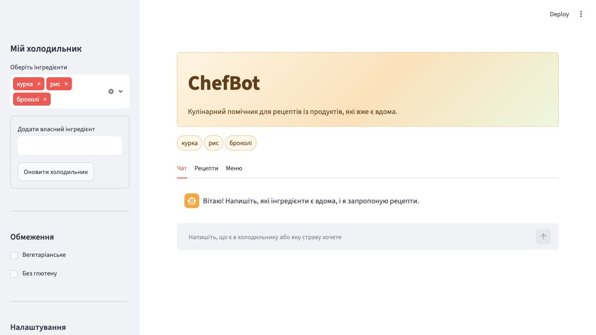
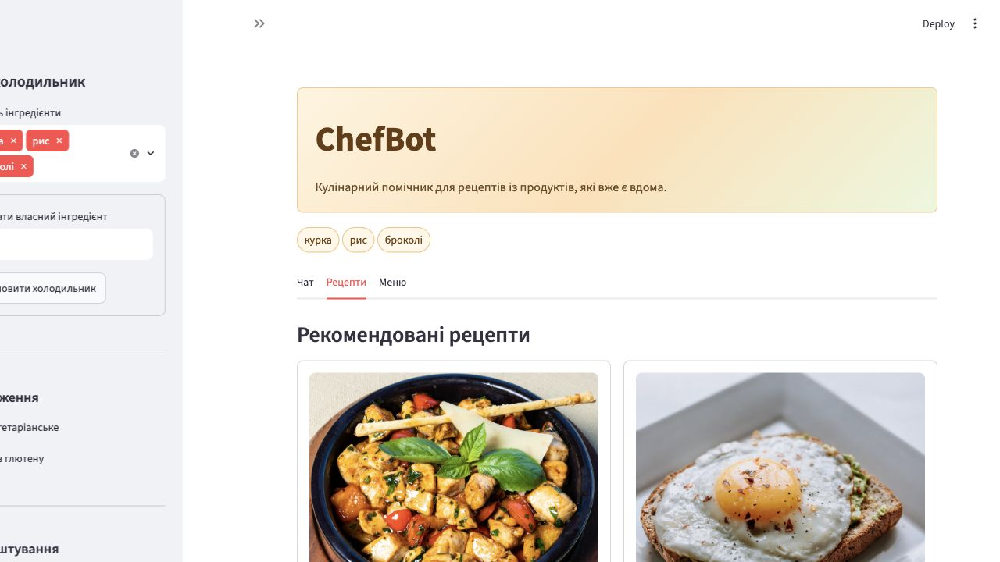
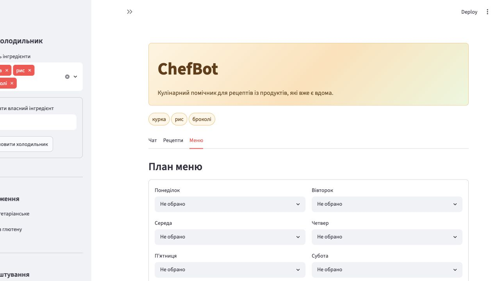

# ChefBot

ChefBot - це Streamlit застосунок для кулінарного помічника. Я вибрав варіант з рецептами, холодильником та плануванням меню.

Застосунок допомагає:

- вести список продуктів у холодильнику;
- підбирати рецепти з наявних інгредієнтів;
- враховувати фільтри `Вегетаріанське` та `Без глютену`;
- спілкуватися в режимі звичайного чату;
- використовувати режим агента з інструментами;
- планувати меню на тиждень;
- експортувати історію чату у JSON.

## Запуск проєкту

Спочатку потрібно створити віртуальне середовище:

```bash
python -m venv .venv
source .venv/bin/activate
```

Потім встановити залежності:

```bash
pip install -r requirements.txt
```

Для запуску:

```bash
streamlit run app.py
```

Після цього застосунок відкриється локально:

```text
http://localhost:8501
```

## API ключ

Для Gemini можна використати `.env` або `.streamlit/secrets.toml`.

Приклад `.env`:

```env
GOOGLE_API_KEY=your_google_gemini_api_key
GEMINI_MODEL=gemini-2.0-flash
```

Приклад `.streamlit/secrets.toml`:

```toml
GOOGLE_API_KEY = "your_google_gemini_api_key"
GEMINI_MODEL = "gemini-2.0-flash"
```

Реальні секрети не додаються в git. Для цього є приклади `.env.example` та `.streamlit/secrets.toml.example`.

## Структура файлів

```text
ChefBot/
├── .streamlit/
│   └── secrets.toml.example
├── app.py
├── agent.py
├── recipe_data.py
├── requirements.txt
├── README.md
├── .env.example
├── .gitignore
└── docs/
    └── screenshots/
        ├── chat.jpg
        ├── recipes.jpg
        └── menu.jpg
```

## Опис файлів

- `app.py` - головний файл Streamlit застосунку. Тут знаходиться інтерфейс, чат, sidebar, вкладки, статистика і експорт історії.
- `agent.py` - модуль LangGraph агента. Тут описані інструменти для роботи з холодильником і рецептами.
- `recipe_data.py` - локальна база рецептів та функції для підбору страв.
- `requirements.txt` - список бібліотек для встановлення.
- `.env.example` - приклад змінних середовища.
- `.streamlit/secrets.toml.example` - приклад Streamlit secrets.
- `docs/screenshots/` - скріншоти інтерфейсу.

## Реалізовані функції

### Чат

У головній області є чат через `st.chat_message()` та `st.chat_input()`. Історія повідомлень зберігається в `st.session_state.messages`.

Є два режими:

- `Звичайний чат` - відповідь через Gemini, якщо є API ключ. Якщо ключа немає, працює локальна відповідь.
- `Агент з інструментами` - режим з LangGraph агентом.

### Холодильник

У sidebar є блок `Мій холодильник`. Там можна вибирати продукти через `st.multiselect()` або додати свій інгредієнт через форму.

### Фільтри

Додані чекбокси:

- `Вегетаріанське`;
- `Без глютену`.

Вони впливають на список рекомендованих рецептів.

### Картки рецептів

Рецепти показуються у вкладці `Рецепти` через `st.container(border=True)`. У картках є:

- зображення страви;
- назва;
- час приготування;
- опис;
- прогрес відповідності інгредієнтам;
- список інгредієнтів;
- кроки приготування.

### План меню

У вкладці `Меню` можна вибрати страви на кожен день тижня. Після збереження меню показується таблицею через `st.dataframe()`.

### Статистика та експорт

У sidebar є метрики:

- кількість запитів;
- кількість відповідей;
- приблизна кількість токенів.

Також є кнопка експорту історії чату у JSON через `st.download_button()`.

## Інструменти агента

В агенті реалізовані такі інструменти:

- `set_fridge_items(items)` - оновлює список інгредієнтів;
- `add_fridge_item(item)` - додає один інгредієнт;
- `list_fridge_items()` - показує продукти в холодильнику;
- `suggest_recipes()` - пропонує рецепти.

## Приклади діалогів

### 1. Звичайний режим чату

Користувач:

```text
У мене є курка, рис та броколі. Що можна приготувати?
```

ChefBot:

```text
Можу запропонувати курку з рисом і броколі.
```

### 2. Додавання інгредієнта

Користувач:

```text
Додай до списку пармезан.
```

ChefBot:

```text
Додано інгредієнт: пармезан.
```

### 3. Перегляд холодильника

Користувач:

```text
Що є в моєму холодильнику?
```

ChefBot:

```text
У холодильнику є: курка, рис, броколі.
```

### 4. Вегетаріанський фільтр

Користувач:

```text
Запропонуй щось вегетаріанське.
```

ChefBot:

```text
Можу запропонувати овочеве рагу з нутом або гречку з грибами та шпинатом.
```

### 5. Безглютеновий фільтр

Користувач:

```text
Порадь страву без глютену.
```

ChefBot:

```text
Можу запропонувати рибу з картоплею та лимоном або омлет із сиром та помідорами.
```

### 6. Планування меню

Користувач:

```text
Я хочу скласти меню на тиждень.
```

ChefBot:

```text
Відкрий вкладку Меню та вибери страви для кожного дня.
```

## Скріншоти

### Чат



### Рекомендовані рецепти



### План меню



## Демонстрація

Застосунок можна запустити локально командою:

```bash
streamlit run app.py
```

Також його можна задеплоїти на Streamlit Community Cloud. Для деплою потрібно вказати:

```text
Repository: student3578659/cheafbot
Branch: main
Main file path: app.py
```
